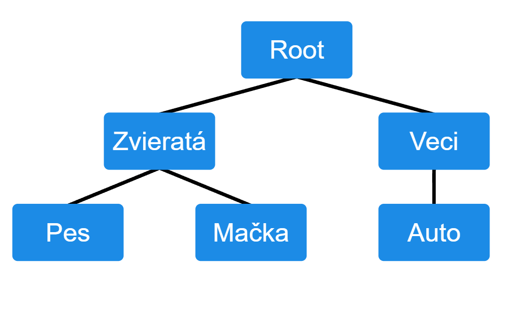

<html>
<head>
<meta charset="UTF-8">
<title>Bakalárska práca</title>

</head>

<body>

    

    

    

<h1>Využitie znalostí z konceptuálneho slovníka</h1>

<b>Školiteľ: Ing. Lukáš Radoský</b> 

<nav class="navbar">
    

        Navigácia
        

            <a href="#zadanie">Zadanie</a>
            <a href="#info">Informácie</a>
            <a href="#pristup">Prístup</a>
            <a href="#vysledky">Výsledky</a>
            <a href="#zdroje">Zdroje</a>
            <a href="#dennik">Denník</a>
        

    

</nav>

<h2>Zadanie</h2>

<h3>Anotácia</h3>

Bakalárska práca sa zaoberá využitím znalostí z konceptuálneho slovníka pri práci s informáciami a znalosťami. Konceptuálny slovník predstavuje štruktúrovaný zdroj pojmov a vzťahov medzi nimi, ktorý umožňuje lepšie porozumenie významu slov a pojmov v rôznych kontextoch. Práca sa zameriava na analýzu možností využitia takéhoto zdroja pri spracovaní informácií a reprezentácii znalostí. Súčasťou práce je aj prehľad existujúcich prístupov a nástrojov, ktoré pracujú s konceptuálnymi slovníkmi, a analýza ich vlastností a využiteľnosti.

<h3>Cieľ práce</h3>

Cieľom bakalárskej práce je preskúmať možnosti využitia znalostí z konceptuálneho slovníka pri reprezentácii a spracovaní informácií. Práca sa zameriava na štúdium existujúcich konceptuálnych slovníkov, analýzu ich štruktúry a spôsobu organizácie znalostí. Na základe získaných poznatkov bude navrhnutý spôsob, akým možno tieto znalosti využiť pri riešení vybraného problému. Výsledkom práce bude návrh alebo realizácia riešenia, ktoré demonštruje praktické využitie konceptuálneho slovníka.

<h2>Základné informácie</h2>

Bakalárska práca sa zaoberá výpočtom sémantickej podobnosti medzi vetami s využitím znalostí z konceptuálneho slovníka. Sémantická podobnosť predstavuje mieru významovej blízkosti medzi textami a umožňuje určiť, do akej miery dva texty vyjadrujú rovnaký alebo podobný význam.

Spracovanie viet pozostáva z viacerých krokov. Najskôr sa vykoná lematizácia vstupných viet, čím sa získajú základné tvary slov. Pre jednotlivé lemy sa následne získavajú koncepty a ich vzťahy z externého konceptuálneho slovníka. Na základe týchto údajov sa pre každú dvojicu viet konštruuje stromová štruktúra reprezentujúca hierarchiu pojmov.

Podobnosť medzi jednotlivými pojmami je určovaná pomocou metódy Wu–Palmer, ktorá vychádza z hĺbky pojmov v hierarchii a ich najbližšieho spoločného predka. Výsledná podobnosť viet sa vypočíta kombináciou podobností medzi slovami oboch viet.

V práci sú implementované viaceré stratégie porovnávania slov, ako napríklad one-to-many a all-to-all prístup. Tieto stratégie sú doplnené o rôzne agregačné metódy (maximum, priemer, minimum), ktoré sa aplikujú na úrovni jednotlivých slov aj celej vety. Okrem toho sa skúmajú aj symetrické varianty porovnávania viet a rôzne váhovacie schémy, vrátane exponenciálneho váhovania a váhovania podľa pozície slov.

Cieľom implementácie je experimentálne porovnať jednotlivé kombinácie týchto prístupov a vyhodnotiť ich kvalitu pomocou korelácie s referenčnými ľudskými hodnoteniami. Práca tak poskytuje prehľad o vplyve jednotlivých komponentov na výslednú kvalitu výpočtu sémantickej podobnosti.

<h2>Navrhnutý prístup</h2>

Navrhnutý prístup vychádza z využitia znalostí z konceptuálneho slovníka na výpočet sémantickej podobnosti medzi vetami. Vstupné vety sú najskôr transformované na množinu lematizovaných slov, ku ktorým sa následne získavajú zodpovedajúce koncepty prostredníctvom API konceptuálneho slovníka.

Na základe získaných konceptov sa pre každú dvojicu viet dynamicky konštruuje sémantická stromová štruktúra. Tento strom obsahuje iba relevantné koncepty a ich vzťahy, čím sa znižuje jeho veľkosť a zvyšuje efektivita spracovania.

Podobnosť medzi jednotlivými konceptmi sa počíta pomocou metódy Wu–Palmer, ktorá zohľadňuje hĺbku konceptov v hierarchii a ich najbližšieho spoločného predka. Výsledná podobnosť viet sa získava pomocou stratégie best-match, kde sa pre každý koncept z prvej vety hľadá najpodobnejší koncept v druhej vete a tieto hodnoty sa následne agregujú.

Implementácia bola rozšírená o viaceré varianty porovnávania a agregácie, ktoré umožňujú experimentálne skúmať vplyv jednotlivých komponentov na výslednú kvalitu modelu.

    
<h2>Materiály a výsledky</h2>

<h3>Dataset</h3>

Použitý dataset: SICK-SK (Slovak STS dataset)

<a href="sick_sk.txt" target="_blank">
Stiahnuť dataset
</a>

<h3>Ukážka dát</h3>

<pre>
4.5  Skupina detí sa hrá na dvore...    Skupina chlapcov na dvore...
3.2  V dome sa hrá skupina detí...     Skupina detí sa hrá na dvore...
</pre>

<h2>Diagram prístupu</h2>

<h2>Príklad sémantického stromu</h2>

<h2>Článok ku konferencii InnovAIte</h2>

<a href="Exploiting conceptual dictionary for semantic textual similarity.pdf" target="_blank">
Stiahnuť článok (PDF)
</a>

<h2>Zdroje</h2>
<ul>

<li>Wu, Z., Palmer, M. (1994). Verb semantics and lexical selection.</li>

<li>Rada, R., Mili, H., Bicknell, E., Blettner, M. (1989). Development and application of a metric on semantic nets.</li>

<li>Leacock, C., Chodorow, M. (1998). Combining local context and WordNet similarity for word sense identification.</li>

<li>Blšták, M. Slovak Conceptual Dictionary. Dostupné online: https://arxiv.org/abs/2512.00579</li>

<li>Marelli, M. et al. (2014). A SICK cure for the evaluation of compositional distributional semantic models.</li>

<li>Radoský, L. et al. Approaches to semantic textual similarity in Slovak language: From algorithms to transformers.</li>

</ul>

<h2>Týždenný denník</h2>

<b>24.2</b>

Stretnutie so školiteľom

Implementácia cachovania pre lemy a koncepty. Výsledky API volaní sa ukladajú do lokálnych JSON súborov, čím sa zabraňuje opakovanému sťahovaniu rovnakých dát. Tento prístup výrazne zrýchľuje spracovanie viet a znižuje závislosť od externého API.

<b>3.3</b>

Stretnutie so školiteľom

Ukladanie vytvorených stromových štruktúr konceptov do JSON súborov. Stromy reprezentujú hierarchiu pojmov získaných z konceptuálneho slovníka a ich uloženie umožňuje ich neskoršiu analýzu, vizualizáciu a opätovné použitie bez nutnosti opakovaného vytvárania.

<b>10.3</b>

Stretnutie so školiteľom

Konzultácia k príprave odborného článku na konferenciu <a href="https://innovaite.sk/" target="_blank">InnovaITE</a> v Žiline. Diskusia sa zamerala na štruktúru článku, formuláciu cieľov a prezentáciu dosiahnutých výsledkov.

<b>17.3</b>

Stretnutie so školiteľom

Diskusia o rôznych stratégiách výpočtu sémantickej podobnosti. Boli navrhnuté a implementované viaceré prístupy porovnávania slov (one-to-many, all-to-all) a agregačné metódy (max, priemer, minimum) na úrovni slov aj viet. Taktiež boli skúmané symetrické varianty porovnania a rôzne váhovacie schémy.

<b>27.3</b>

Stretnutie so školiteľom

Na základe konzultácie boli upravené a rozšírené navrhované prístupy a stratégie riešenia.

</body>
</html>
